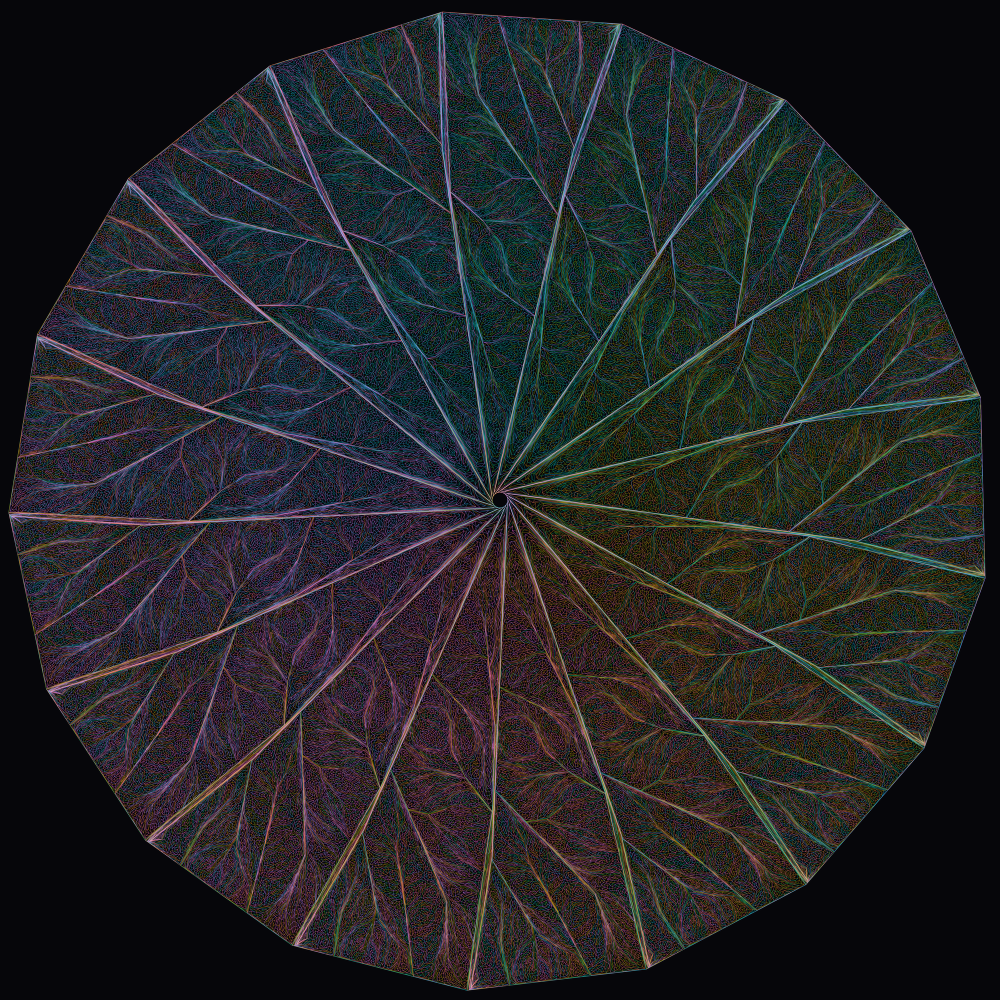

# Simple symmetric Venn diagrams with 17 and 19 curves



*One of the four diagrams, drawn at uniform crossing density (every crossing is a simple double
point; all 131,072 regions present exactly once).*

A simple symmetric Venn diagram is a family of n closed curves, mapped to itself by rotation
through 2π/n, in which every one of the 2^n combinations of inside/outside appears as exactly one
connected region and every crossing point lies on exactly two curves. Grünbaum asked in 1975
whether they exist for every prime n. They were known for n = 3, 5, 7, 11 and 13 (the last two
found by Mamakani and Ruskey in 2012 and 2014, who wrote that their methods fail at 17); the 2026
survey of Brenner, Gregor, Mütze and Verciani lists the problem as open beyond 13. This repository
publishes four simple symmetric 17-Venn diagrams, found on 17 September 2026, and six simple
symmetric 19-Venn diagrams, found on 20 and 21 September 2026, as machine-checkable certificates,
together with an independent checker, formal verifications in Lean of one certificate of each size,
the search code, and a short paper. It also contains the first non-monotone simple symmetric Venn
diagrams with 11 and 13 curves.

The same diagram in the earlier rose rendering is `images/venn17-rose-dark-2000.png`.

This repository holds twelve certificates for simple symmetric Venn diagrams together with
everything needed to check them: six 19-curve certificates (`certificates/venn19-closure-*.json`,
found 2026-09-20/21, see [19 curves](#19-curves) below), four independent 17-curve certificates
(`certificates/venn17-*.json`, found 2026-09-17), an 11-curve and a 13-curve certificate (`certificates/best11-s0.json`,
`certificates/v3-13-s0.json`), a standalone structural checker (`verify/`), the search program and
the exact run configurations that produced the four 17-curve solutions (`search/`), a pen-plotter
SVG exporter with rendered 11- and 13-curve drawings (`plotter/`), and a write-up (`paper/`).
`verify/RESULTS.md` records the checker's transcript on the six 11-, 13- and 17-curve files and
`verify/RESULTS-19.md` on the six 19-curve files: all twelve PASS every criterion the checker tests, and
all twelve are non-monotone by the Bultena-Grunbaum-Ruskey test in `verify/monotone_test.py`.

## 19 curves

Three days after the 17-curve diagrams, the same search found simple symmetric Venn diagrams with 19
curves: three on 20 September 2026, three more overnight on 21 September, and a seventh on 22 September
from a run started fresh from the resolved Griggs–Killian–Savage diagram, 32.6 hours in. Each certificate lists
the 2^19 - 2 = 524,286 crossings as quadruples of 19-bit labels (47 MB each); the checker below runs
on them unchanged (about a minute per file).

| file | sha256 |
| --- | --- |
| `venn19-closure-s196002.json` | `ed26b3baa6e5c02bc3a4239b1dfbf84d66f731cad2dd2805a8c1770e2c1fdb5d` |
| `venn19-closure-s196004.json` | `ca84c06e669461dfc4d5e070d37518dfd687e7cf7348893e60802867133e6653` |
| `venn19-closure-s195001.json` | `11142a0d03800cde4680e6635c0ec986a8f08b698be1bacfe849a6ce951d26bb` |
| `venn19-closure-s196001.json` | `b550adb91f0898059bff18616236cce0cc7a1062f7ef7582eba1649df23b45d2` |
| `venn19-closure-s196007.json` | `0f057a0779cdeaa26f4a8af8ac5d96e997c243197817493b9ef4244964dbe225` |
| `venn19-closure-s195002.json` | `c801a956f9a6406f708e75c3b423b4ddd77dcb63ebca4f927f0223c25069202f` |
| `venn19-fresh-s192015.json` | `45a8aee92516c682b337e1e21b3a1f7101a78ec342cd3c2360fae2847da3b3d2` |

Check them with `cd certificates && shasum -a 256 -c SHA256SUMS`.

The seven face sets are pairwise distinct (the smallest symmetric difference between two of them is
25,460 faces, the largest 940,272; the fresh-start diagram shares only about a tenth of its faces with
any of the other six). All seven are non-monotone. Each was verified, before being added
here, by the search engine's own structural reload, by the independent checker `verify/verify.py`,
and by a third auditor written by Codex that shares no code with either.

`venn19-closure-s196002.json` has also been checked by machine proof: `verify/lean19/` is a port of
Justin Grimes's Lean 4 formalization from `verify/lean/` to n = 19, carried out by Codex (OpenAI)
from his sources. The dimension-dependent constants were changed and the finite meridian and sector
certificates the proof consumes were regenerated for 19; the vendored topology library is
byte-identical to the 17-curve bundle, and Grimes's `LICENSE` and `CITATION.cff` are preserved
unchanged (see `verify/lean19/PORT-CREDITS.md`). It proves
`Venn19.Topology.exists_simple_rotational_venn_19`: there exist 19 curves and sides satisfying the same
`SimpleRotationalVenn` predicate as at 17, for the diagram built from this certificate. Its axioms,
listed in `verify/lean19/FINAL-THEOREM-AXIOMS.txt`, are `propext`, `Classical.choice`, `Quot.sound`
and twenty `native_decide` certificates, exactly the 17-curve proof's list under the namespace
rename. The build takes about twenty minutes with the vendored library reused.

What changed in the search at 19, and the exact state one move before each completion, are described
in the paper (`paper/venn17-19.pdf`) and recorded in the research tree that accompanies this
repository.

## Verify it yourself

You need Python 3.8 or newer and nothing else: the checker imports only the standard library, so
there is no `pip install` step (NumPy is needed for the plotter, not for verification). From a
fresh clone:

```
git clone https://github.com/dzoba/venn17.git
cd venn17
python3 --version                                        # 3.8+; run here on 3.14.3
python3 verify/verify.py certificates/venn17-local-c3-s2.json
```

The run prints the computed report (V, E, F, Euler characteristic, edge multiplicities, face
sizes), then one line per criterion, and its **last line is exactly `RESULT: PASS`**; the exit
status is 0. Expect about **11 seconds** and about 370 MB of peak memory for a 17-curve
certificate on a current laptop, and under a second for the 11- and 13-curve files. Any path on
the command line works, and several at once check them all in one run (the exit status is 0 only
if every file passes), so
`python3 verify/verify.py certificates/*.json` reproduces the transcript in `verify/RESULTS.md`.
`certificates/venn17-local-c3-s2.json` has also been checked by an independent machine proof in
Lean 4, written by Justin Grimes and included in `verify/lean/`; see
[Formal verification (Lean)](#formal-verification-lean) below.

Confirm you have the same bytes: `cd certificates && shasum -a 256 -c SHA256SUMS` prints `OK` for
each of the six files. The `sha256` sums are also here, so they can be compared against a clone
you did not make:

| file | sha256 |
| --- | --- |
| `best11-s0.json` | `865d73add9779287f17580240cd2669a8e7fd9286d720c03f261878e52528271` |
| `v3-13-s0.json` | `f01d59b7cc843dcf824b40b50b8f616953e775f0b2b0df28bdefbfc0a1ea67e2` |
| `venn17-gcp-s12.json` | `87f981b849073daa79b1438f1bb895e6bcac1926fe1c141e9b2c7617a04ff29b` |
| `venn17-gcp-s14.json` | `eec8cd5520337c60b9ecdbd9bf006ceb10002decdac94b6d51f08b19ac54a342` |
| `venn17-gcp-s16.json` | `431857aa80891474d1e5a91228fc3bcbcdd0c2caa24180993fb4ea6ac8f75173` |
| `venn17-local-c3-s2.json` | `c178d7bdde6e02b1b0c2780339434095d3633b8bb77a7293e9d575d04ad7ae77` |

### What the checker proves, and what it does not

`verify.py` reads the certificate, re-orients its faces with `interval_growth.oriented_faces`,
runs `gks_scaffold.check` on the result, prints every field of the report, and prints
`RESULT: PASS` only when all eight of these hold — the seven conditions of the proposition in the
paper, plus a check that no face repeats a vertex:

| criterion | meaning |
| --- | --- |
| `all_labels` | all 2^n labels present, each exactly once |
| `euler == 2` | V - E + F = 2, so the map is a sphere |
| every edge multiplicity `== 2` | each edge borders exactly two faces |
| `vertices_single_rotation_cycle` | the rotation at every vertex is a single cycle |
| `curves_two_sides_connected` | both sides of every curve are connected, so each curve is one Jordan curve |
| `rotation_symmetric` | the face set is invariant under the Z_n rotation of labels |
| `non_transversal_faces == 0` | every crossing is transversal (bit pattern w.w) |
| `repeated_vertex_faces == 0` | no face repeats a vertex |

Together these say the file is the dual map of a simple, symmetric *n*-Venn diagram; the
proposition in `paper/venn17.tex` is what turns that combinatorial statement into a drawing in the
plane.

The checker trusts nothing in the file beyond the `faces` list and `n`. It ignores every other
top-level key, including the stated label count and anything about where the file came from, and
recomputes the vertex set, the edge set, the face orientations, the Euler characteristic and the
symmetry from the faces alone. So a passing file stands on its own: it does not depend on the
search program in `search/`, on the renderings in `plotter/` or `images/` (which are drawings of a
certificate, not evidence for it), or on any claim made in this README. What the checker does not
do: it does not test monotonicity (`verify/monotone_test.py` does that separately), and it does
not check that a certificate is new or distinct from the others.

`verify/gks_scaffold.py`, `verify/interval_growth.py` and `verify/gks_chains.py` are copied
unchanged from the scaffold work and share no code with the search program in `search/`.

## Formal verification (Lean)

`certificates/venn17-local-c3-s2.json` has also been checked by machine proof, in an independent
Lean 4 formalization written by **Justin Grimes**. It lives in `verify/lean/`, exactly as he
supplied it; his `README.md`, `REALIZATION.md`, `LICENSE` and `CITATION.cff` are unmodified. It
shares no code with `verify/verify.py` — it re-implements the parser, the checker and the geometry
from scratch, and it goes further than the Python checker by proving that the combinatorial
certificate is actually drawable in the plane.

### What it proves

The top-level theorem is `Venn17.Topology.supplied_simple_rotational_venn`, in
[`verify/lean/VennTopology/RotationalVenn.lean`](verify/lean/VennTopology/RotationalVenn.lean):

```lean
structure SimpleRotationalVenn (C : Fin 17 → Set Plane) (S : Fin 17 → Bool → Set Plane) : Prop where
  jordan : ∀ i, ∃ f : Circle → Plane, Continuous f ∧ Function.Injective f ∧ range f = C i
  sides : ∀ i b, IsOpen (S i b) ∧ IsPathConnected (S i b)
  disjoint : ∀ i, Disjoint (S i false) (S i true)
  complement : ∀ i, (⋃ b, S i b) = (C i)ᶜ
  inside_bounded : ∀ i, Bornology.IsBounded (S i true)
  outside_unbounded : ∀ i, ¬ Bornology.IsBounded (S i false)
  regions : ∀ b : Fin 17 → Bool, IsPathConnected (⋂ i, S i (b i))
  no_triple : ∀ i j k, i ≠ j → i ≠ k → j ≠ k → ∀ x, x ∈ C i → x ∈ C j → x ∉ C k
  crossings : ∀ x, (∃ i j, i ≠ j ∧ x ∈ C i ∧ x ∈ C j) →
    ∃ i j, i ≠ j ∧ CrossingSquare.HasCrossingChart (C i) (C j) x
  rotation : ∀ i, rigidPlaneRotation '' C i = C (cyclicNext i)

theorem supplied_simple_rotational_venn :
    SimpleRotationalVenn rotationalVennCurve rotationalVennSide
```

`Plane` is `EuclideanSpace ℝ (Fin 2)`. Read as mathematics: seventeen topologically embedded
circles in the plane; each one separating a bounded inside from an unbounded outside; every one of
the 2^17 intersections of chosen sides nonempty and path-connected (`IsPathConnected` includes
nonemptiness — this is the Venn condition); no point lying on three curves; every double point a
transverse crossing; and the whole family carried onto itself by `rigidPlaneRotation`, which is a
genuine rigid rotation of the plane about the origin through exactly 2π/17
(`rigidGenerator : Circle := Circle.exp (2 * Real.pi / 17)`), sending curve *i* to curve *i+1*.
`exists_simple_rotational_venn_17` restates it as a bare existence theorem.

`Venn17.supplied_file_verified` in `verify/lean/Venn17/Proof.lean` separately re-proves the finite
combinatorial side against the same bytes — 131,072 regions, 262,140 arcs, 131,070 crossings,
Euler characteristic 2, every bit pattern occurring, both sides of every curve connected, every
crossing a bit-square, rotational symmetry — as does the standalone `venn_check` executable.

### Which bytes are verified

Only `venn17-local-c3-s2.json`. The copy in `verify/lean/` is byte-identical to
`certificates/venn17-local-c3-s2.json`
(`c178d7bdde6e02b1b0c2780339434095d3633b8bb77a7293e9d575d04ad7ae77`). The file is embedded into
the proof as a string literal at elaboration time by the `input_file%` elaborator
(`verify/lean/VennCore/Embed.lean`) and is a declared Lake input, so editing it invalidates the
build. The proof binds the *path*, not the hash: the SHA-256 is recorded in
`verify/lean/SHA256SUMS`, in the `suppliedJSON` docstring and in `verify/lean/BUNDLE-MANIFEST.json`,
and is checked by `shasum -c` and `verify_bundle.py` — not by the Lean build itself. The other
three 17-curve certificates have not been formalized.

### Trust boundary

No `sorry` anywhere, and no hand-written mathematical axioms. The large input-specific facts use
`native_decide`, which trusts Lean's compiler and runtime and records one named axiom per
computation. `supplied_simple_rotational_venn` depends on 23 axioms: `propext`, `Classical.choice`,
`Quot.sound`, and 20 `native_decide` certificates (spanning trees, incidences, cyclic links, curve
polygons, crossing labels, meridian and sector witnesses, and the rotation identity). The full
report is `verify/lean/topology-axioms.txt`, reproduced by the `audit_topology` step below. The
geometric argument rests on 309 modules vendored unchanged from
[mccorvie/classification-of-surfaces](https://github.com/mccorvie/classification-of-surfaces) at
commit `e3c7230fe78d7b056a415d9ecae6f77887046b32` — surface classification and the strong
Schoenflies theorem — whose hashes `scripts/audit_vendor.py` checks.

### Rebuild it

Lean 4.32.1 and Mathlib `520045ab14e26149ee970e2e617ca04b09bde5d6` are pinned by
`verify/lean/lean-toolchain` and `verify/lean/lake-manifest.json`; do not run `lake update`. From a
fresh clone, with [elan](https://github.com/leanprover/elan) installed or not:

```
curl https://raw.githubusercontent.com/leanprover/elan/master/elan-init.sh -sSf | sh -s -- -y
export PATH="$HOME/.elan/bin:$PATH"
cd verify/lean
python3 verify_bundle.py                        # 465 packaged files, SHA-256
elan toolchain install leanprover/lean4:v4.32.1
lake exe cache get                              # Mathlib's compiled cache, 8639 files
lake build                                      # 3468 jobs
lake env lean scripts/audit_topology.lean       # reprints the axiom report
lake exe venn_check venn17-local-c3-s2.json
python3 scripts/audit_vendor.py
shasum -a 256 -c SHA256SUMS
```

`lake build` ends with `Build completed successfully (3468 jobs).` — that build *is* the check of
the geometric theorem, since Lean's kernel verifies it while elaborating
`VennTopology.RotationalVenn`. `audit_topology` must reproduce `topology-axioms.txt` byte for
byte. `venn_check` runs the finite checker only and ends with

```
PASS: all finite combinatorial checks. Geometric realization is not formalized.
```

(its "not formalized" refers to that executable, which is the finite checker; the realization is
what `lake build` proves.)

Measured here on an Apple M4 Max (16 cores, 128 GB), macOS 26.6.2, starting from a machine with no
Lean installed at all:

| step | wall time | peak RSS |
| --- | --- | --- |
| `lake exe cache get` | 2 min 25 s | 0.8 GB |
| `lake build` | 9 min 6 s | 3.4 GB |
| `lake env lean scripts/audit_topology.lean` | 4.7 s | 3.3 GB |
| `lake exe venn_check venn17-local-c3-s2.json` | 8.9 s | 0.7 GB |

`.lake/` grows to about 8.3 GB and is gitignored. Without `lake exe cache get`, Lean builds Mathlib
from source instead, which takes hours.

### License

The Lean proof, its scripts and its documentation are under the **Apache License 2.0**
(`verify/lean/LICENSE`), not the MIT/CC BY licensing of the rest of this repository. Cite it with
`verify/lean/CITATION.cff`: Justin Grimes, *Lean formalization of a simple rotationally symmetric
17-Venn diagram*, version 1.0.0, 2026-09-18 — that citation credits the formalization only, not
the diagram or the certificate. The vendored modules and the Lake dependencies keep their own
upstream licenses and notices.

## Certificate format

A certificate is the **dual map** of the arrangement, as JSON:

```json
{"n": 17, "labels": 131072, "faces": [["00011111001010111", "00011111101010111",
                                       "00011111101010011", "00011111001010011"], ...]}
```

Each label is an `n`-character **LSB-first** bit string naming one region of the arrangement: bit
`i` is `1` when the region is inside curve `i`. Each entry of `faces` is one vertex (crossing) of
the Venn diagram, given as the four labels of the regions around it, in cyclic order; consecutive
labels in a face differ in exactly one bit. A 17-curve certificate has 131,072 labels and 131,070
faces. `n`, `labels` and the other top-level keys vary between files and are ignored by the checker
apart from `n`.

## Contents

| path | what it is |
| --- | --- |
| `certificates/` | the twelve certificates and `SHA256SUMS` |
| `verify/verify.py` | the checker; `verify/RESULTS.md` and `verify/RESULTS-19.md` are its output on all twelve certificates |
| `verify/monotone_test.py` | Bultena-Grunbaum-Ruskey monotonicity test |
| `verify/lean/` | Justin Grimes's independent Lean 4 proof (Apache-2.0), see [Formal verification (Lean)](#formal-verification-lean) |
| `verify/lean19/` | the port of that proof to 19 curves (Apache-2.0), see [19 curves](#19-curves) |
| `search/relaxed_walk5.cpp` | the relaxed Metropolis walk that found the 17-curve solutions |
| `search/BUILD.md` | how to build it and the run configurations behind the four solutions |
| `search/README.md` | the running log of the search, copied unchanged |
| `plotter/plotter_svg.py` | pen-plotter SVG exporter, plus rendered 11- and 13-curve drawings |
| `images/` | the two drawings shown in this README, plus the earlier rose rendering |
| `paper/venn17-19.tex`, `paper/venn17-19.pdf` | the write-up covering 17 and 19 curves (`paper/venn17.tex` is the original 17-curve note) |

`plotter_svg.py` expects the scaffold modules on its import path; run it as
`PYTHONPATH=verify python3 plotter/plotter_svg.py certificates/best11-s0.json`. It needs NumPy,
and rsvg-convert or Inkscape for the PNG preview.


*The 13-curve certificate `certificates/v3-13-s0.json` drawn by `plotter/plotter_svg.py`: the
first non-monotone simple symmetric Venn diagram with 13 curves.*

## How it was found

The diagrams were found by a Metropolis walk on rotation-invariant quadrangulations of the sphere
in which regions may temporarily be duplicated, annealed in the weight of the duplicates, starting
from the Griggs–Killian–Savage symmetric diagram for n = 17 or 19 with its multiple crossings resolved.
The search was designed and carried out by two AI systems, Claude (Anthropic) and Codex (OpenAI),
working under the direction of Chris Dzoba over five days; their roles are stated in full in the
paper (`paper/venn17-19.pdf`, section "Tool and computational resource disclosure"). The certificates stand
on their own: nothing about their validity depends on how they were produced.

## Citing and licensing

`CITATION.cff` has the citation metadata. Version 1.1 of this repository (certificates, checkers, both Lean
developments, search code, plotter, images and the paper) is archived on Zenodo:
https://doi.org/10.5281/zenodo.22885650.

The code (`verify/`, `search/`, `plotter/`) is released under the MIT License, see `LICENSE`. The
certificates (`certificates/`), the images (`images/`) and the paper (`paper/`) are released under
[Creative Commons Attribution 4.0 International (CC BY 4.0)](https://creativecommons.org/licenses/by/4.0/).
