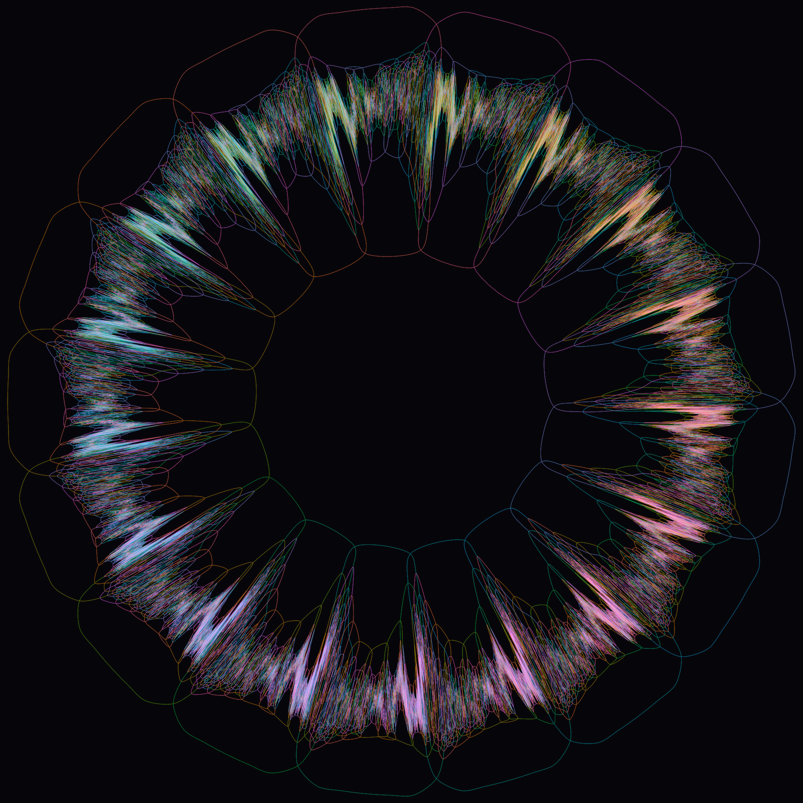
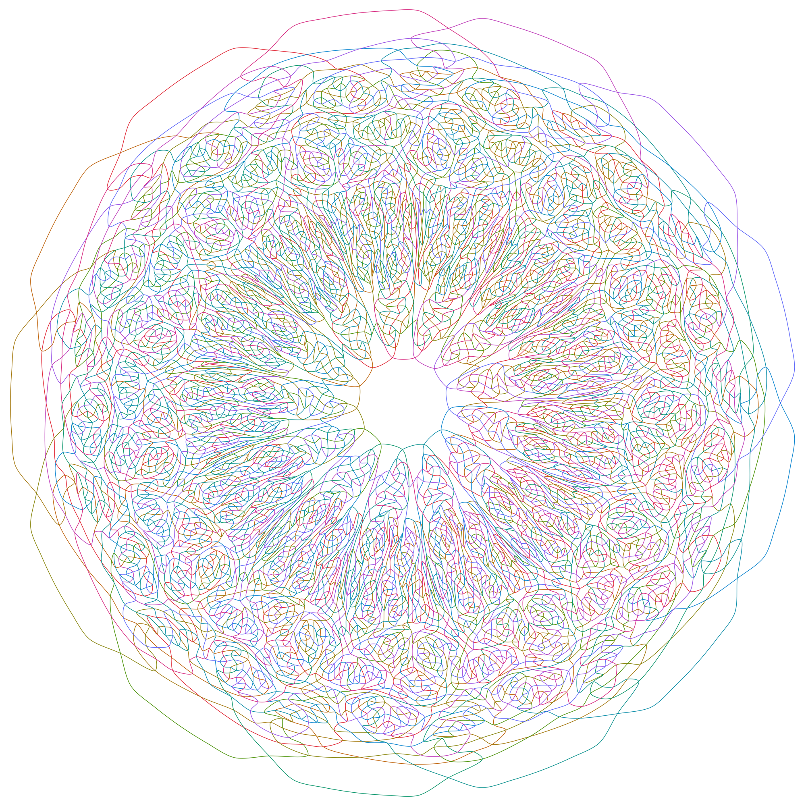

# venn17



*One of the four diagrams; every crossing is a simple double point; the 131,072 regions are all
present exactly once.*

This repository holds six certificates for simple symmetric Venn diagrams together with
everything needed to check them: four independent 17-curve certificates (`certificates/venn17-*.json`,
found 2026-09-17), an 11-curve and a 13-curve certificate (`certificates/best11-s0.json`,
`certificates/v3-13-s0.json`), a standalone structural checker (`verify/`), the search program and
the exact run configurations that produced the four 17-curve solutions (`search/`), a pen-plotter
SVG exporter with rendered 11- and 13-curve drawings (`plotter/`), and a write-up (`paper/`).
`verify/RESULTS.md` records the checker's transcript on all six files: all six PASS every criterion
the checker tests, and all six are non-monotone by the Bultena-Grunbaum-Ruskey test in
`verify/monotone_test.py`.

## Verify it yourself

You need Python 3.8 or newer and nothing else: the checker imports only the standard library, so
there is no `pip install` step (NumPy is needed for the plotter, not for verification). From a
fresh clone:

```
git clone https://github.com/dzoba/venn17.git
cd venn17
python3 --version                                        # 3.8+; run here on 3.14.3
python3 verify/verify.py certificates/venn17-local-c3-s2.json
```

The run prints the computed report (V, E, F, Euler characteristic, edge multiplicities, face
sizes), then one line per criterion, and its **last line is exactly `RESULT: PASS`**; the exit
status is 0. Expect about **11 seconds** and about 370 MB of peak memory for a 17-curve
certificate on a current laptop, and under a second for the 11- and 13-curve files. Any path on
the command line works, and several at once check them all in one run (the exit status is 0 only
if every file passes), so
`python3 verify/verify.py certificates/*.json` reproduces the transcript in `verify/RESULTS.md`.
The certificates have also been formally verified in the Lean proof assistant by Justin Grimes
(independent implementation).

Confirm you have the same bytes: `cd certificates && shasum -a 256 -c SHA256SUMS` prints `OK` for
each of the six files. The `sha256` sums are also here, so they can be compared against a clone
you did not make:

| file | sha256 |
| --- | --- |
| `best11-s0.json` | `865d73add9779287f17580240cd2669a8e7fd9286d720c03f261878e52528271` |
| `v3-13-s0.json` | `f01d59b7cc843dcf824b40b50b8f616953e775f0b2b0df28bdefbfc0a1ea67e2` |
| `venn17-gcp-s12.json` | `87f981b849073daa79b1438f1bb895e6bcac1926fe1c141e9b2c7617a04ff29b` |
| `venn17-gcp-s14.json` | `eec8cd5520337c60b9ecdbd9bf006ceb10002decdac94b6d51f08b19ac54a342` |
| `venn17-gcp-s16.json` | `431857aa80891474d1e5a91228fc3bcbcdd0c2caa24180993fb4ea6ac8f75173` |
| `venn17-local-c3-s2.json` | `c178d7bdde6e02b1b0c2780339434095d3633b8bb77a7293e9d575d04ad7ae77` |

### What the checker proves, and what it does not

`verify.py` reads the certificate, re-orients its faces with `interval_growth.oriented_faces`,
runs `gks_scaffold.check` on the result, prints every field of the report, and prints
`RESULT: PASS` only when all eight of these hold — the seven conditions of the proposition in the
paper, plus a check that no face repeats a vertex:

| criterion | meaning |
| --- | --- |
| `all_labels` | all 2^n labels present, each exactly once |
| `euler == 2` | V - E + F = 2, so the map is a sphere |
| every edge multiplicity `== 2` | each edge borders exactly two faces |
| `vertices_single_rotation_cycle` | the rotation at every vertex is a single cycle |
| `curves_two_sides_connected` | both sides of every curve are connected, so each curve is one Jordan curve |
| `rotation_symmetric` | the face set is invariant under the Z_n rotation of labels |
| `non_transversal_faces == 0` | every crossing is transversal (bit pattern w.w) |
| `repeated_vertex_faces == 0` | no face repeats a vertex |

Together these say the file is the dual map of a simple, symmetric *n*-Venn diagram; the
proposition in `paper/venn17.tex` is what turns that combinatorial statement into a drawing in the
plane.

The checker trusts nothing in the file beyond the `faces` list and `n`. It ignores every other
top-level key, including the stated label count and anything about where the file came from, and
recomputes the vertex set, the edge set, the face orientations, the Euler characteristic and the
symmetry from the faces alone. So a passing file stands on its own: it does not depend on the
search program in `search/`, on the renderings in `plotter/` or `images/` (which are drawings of a
certificate, not evidence for it), or on any claim made in this README. What the checker does not
do: it does not test monotonicity (`verify/monotone_test.py` does that separately), and it does
not check that a certificate is new or distinct from the others.

`verify/gks_scaffold.py`, `verify/interval_growth.py` and `verify/gks_chains.py` are copied
unchanged from the scaffold work and share no code with the search program in `search/`.

## Certificate format

A certificate is the **dual map** of the arrangement, as JSON:

```json
{"n": 17, "labels": 131072, "faces": [["00011111001010111", "00011111101010111",
                                       "00011111101010011", "00011111001010011"], ...]}
```

Each label is an `n`-character **LSB-first** bit string naming one region of the arrangement: bit
`i` is `1` when the region is inside curve `i`. Each entry of `faces` is one vertex (crossing) of
the Venn diagram, given as the four labels of the regions around it, in cyclic order; consecutive
labels in a face differ in exactly one bit. A 17-curve certificate has 131,072 labels and 131,070
faces. `n`, `labels` and the other top-level keys vary between files and are ignored by the checker
apart from `n`.

## Contents

| path | what it is |
| --- | --- |
| `certificates/` | the six certificates and `SHA256SUMS` |
| `verify/verify.py` | the checker; `verify/RESULTS.md` is its output on all six certificates |
| `verify/monotone_test.py` | Bultena-Grunbaum-Ruskey monotonicity test |
| `search/relaxed_walk5.cpp` | the relaxed Metropolis walk that found the 17-curve solutions |
| `search/BUILD.md` | how to build it and the run configurations behind the four solutions |
| `search/README.md` | the running log of the search, copied unchanged |
| `plotter/plotter_svg.py` | pen-plotter SVG exporter, plus rendered 11- and 13-curve drawings |
| `images/` | the two drawings shown in this README |
| `paper/venn17.tex`, `paper/venn17.pdf` | the write-up |

`plotter_svg.py` expects the scaffold modules on its import path; run it as
`PYTHONPATH=verify python3 plotter/plotter_svg.py certificates/best11-s0.json`. It needs NumPy,
and rsvg-convert or Inkscape for the PNG preview.



*The 13-curve certificate `certificates/v3-13-s0.json` drawn by `plotter/plotter_svg.py`: the
first non-monotone simple symmetric Venn diagram with 13 curves.*

## Citing and licensing

`CITATION.cff` has the citation metadata; add the Zenodo DOI there once the archive is published.

The code (`verify/`, `search/`, `plotter/`) is released under the MIT License, see `LICENSE`. The
certificates (`certificates/`), the images (`images/`) and the paper (`paper/`) are released under
[Creative Commons Attribution 4.0 International (CC BY 4.0)](https://creativecommons.org/licenses/by/4.0/).
