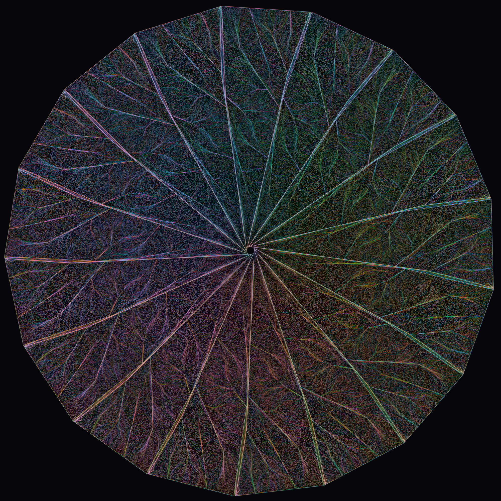
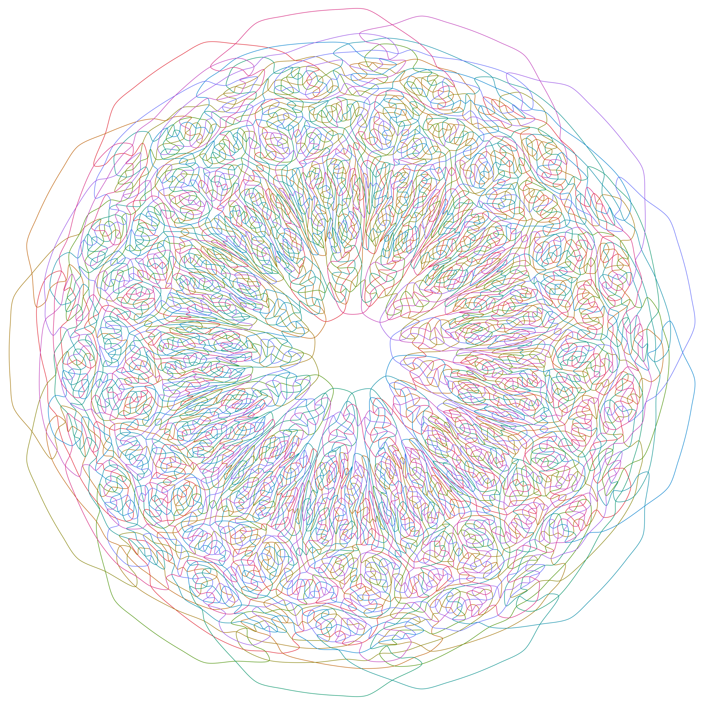

# Simple symmetric Venn diagrams with 17, 19 and 23 curves



*One of the four 17-curve diagrams, drawn at uniform crossing density (every crossing is a simple double
point; all 131,072 regions present exactly once).*

A simple symmetric Venn diagram is a family of n closed curves, mapped to itself by rotation
through 2π/n, in which every one of the 2^n combinations of inside/outside appears as exactly one
connected region and every crossing point lies on exactly two curves. Grünbaum asked in 1975
whether they exist for every prime n. They were known for n = 3, 5, 7, 11 and 13 (the last two
found by Mamakani and Ruskey in 2012 and 2014, who wrote that their methods fail at 17); the 2026
survey of Brenner, Gregor, Mütze and Verciani lists the problem as open beyond 13. This repository
publishes four simple symmetric 17-Venn diagrams, found on 17 September 2026, twelve simple
symmetric 19-Venn diagrams, found between 20 and 23 September 2026, and five simple symmetric
23-Venn diagrams, found on 5 and 6 October 2026, as machine-checkable certificates, together with an
independent checker, formal verifications in Lean of one 17-curve and one 19-curve certificate,
the search code, and a short paper. It also contains the first non-monotone simple symmetric Venn
diagrams with 11 and 13 curves.

The same diagram in the earlier rose rendering is `images/venn17-rose-dark-2000.png`.

This repository holds twenty-three certificates for simple symmetric Venn diagrams together with
everything needed to check them: five 23-curve certificates (`venn23-*.json`, found 2026-10-05 and 06, 889 MB
each and therefore carried as release assets and on Zenodo rather than in the git tree, see
[23 curves](#23-curves) below), twelve 19-curve certificates (`certificates/venn19-*.json`,
found 2026-09-20 to 23, see [19 curves](#19-curves) below), four independent 17-curve certificates
(`certificates/venn17-*.json`, found 2026-09-17), an 11-curve and a 13-curve certificate (`certificates/best11-s0.json`,
`certificates/v3-13-s0.json`), a standalone structural checker (`verify/`), the search program and
the exact run configurations that produced the four 17-curve solutions (`search/`), a pen-plotter
SVG exporter with rendered 11- and 13-curve drawings (`plotter/`), and a write-up (`paper/`).
`verify/RESULTS.md` records the checker's transcript on the six 11-, 13- and 17-curve files,
`verify/RESULTS-19.md` on the twelve 19-curve files and `verify/RESULTS-23.md` on the five 23-curve
files: every file checked passes every criterion the checker tests, and every one is non-monotone by
the Bultena-Grunbaum-Ruskey test in `verify/monotone_test.py`.

## 23 curves

Two weeks after the 19-curve diagrams, the same search found simple symmetric Venn diagrams with 23
curves: five within a little over eight hours of one another, on the night of 5 to 6 October 2026.
In order of discovery they are `venn23-c6p-s1065101` (the pilot, at about 22:46 EDT on 5 October,
02:46 UTC on 6 October), `venn23-c25-s230025` (00:00:09 EDT, 04:00 UTC), `venn23-c19-s230019`
(02:15 EDT, 06:15 UTC), `venn23-c21-s230021` (04:58 EDT, 08:58 UTC) and `venn23-f4-s254004` (06:54
EDT, 10:54 UTC), all on 6 October in UTC. They come from two lineages: the pilot, `c25`, `c21` and
`f4` descend from lineage c6, `c19` from lineage c9 (see below). Four of the five were found on the
author's laptop; `f4` was found on a cloud virtual machine (a 4-vCPU `c2d-highcpu-4` instance in
Google Cloud's `us-east4-b` zone) running the same program. The pilot was found by a different
program from the other four: the plain Metropolis walk of Codex's engine, started from an earlier
state of lineage c6, and it was the fourth of the five to be recognised, more than seven hours after
its run had validated it. Each certificate lists the 2^23 - 2 = 8,388,606 crossings as quadruples of
23-bit labels. At 889,192,322 bytes each they are too large for a git repository, so they are not in
`certificates/`: they are published as gzip-compressed release assets of this repository
(`venn23-c6p-s1065101.json.gz`, `venn23-c25-s230025.json.gz`, `venn23-c19-s230019.json.gz`,
`venn23-c21-s230021.json.gz`, `venn23-f4-s254004.json.gz`; release tag `v1.3`) and
in the Zenodo archive (version 1.3, https://doi.org/10.5281/zenodo.23189412). The checker runs on the decompressed files unchanged.

| file | sha256 (decompressed `.json`) | bytes |
| --- | --- | --- |
| `venn23-c25-s230025.json` | `adc5a02eeaac6e49ac56ed9acfe6aebf5325ca13ebe070486c792b0d80eae2b1` | 889,192,322 |
| `venn23-c19-s230019.json` | `5dfddac2a16d72685b2c63be098a7e1526778b32bdfa9872563f455b40a2a19f` | 889,192,322 |
| `venn23-c21-s230021.json` | `e6849a0b4fb13059d8fcbe040745357f88762938787d7e3b23c0ca72784cbc12` | 889,192,322 |
| `venn23-c6p-s1065101.json` | `6e923fbccfc6af5724317e257d01ed7e9c97ce25fab879f025e9bca56b394a35` | 889,192,322 |
| `venn23-f4-s254004.json` | `5888e16a816f5004399ce4e9ed1cd7b86cfdcc57fb908134455cd0d87122a3f4` | 889,192,322 |

| release asset | sha256 (of the compressed `.json.gz`) | bytes |
| --- | --- | --- |
| `venn23-c25-s230025.json.gz` | `e590d5626eb328f21a2dba39d8ef0e45af1a6211aa90ae0c27365e3c8f65daef` | 102,759,025 |
| `venn23-c19-s230019.json.gz` | `2ceed7df04c66efd1ccd70cd0340931dbc3173aaa6d2ac4a930b89a21ec62ed4` | 102,783,706 |
| `venn23-c21-s230021.json.gz` | `1eaff1e7dbf7fe1513290902bab1af691665e0b8e8945ce624a78ef7b35deb8d` | 102,755,663 |
| `venn23-c6p-s1065101.json.gz` | `641ba5a0bf2c519caaaa7f9b8671b54bfdf28f60e71c2a04f127d59add49b072` | 102,754,698 |
| `venn23-f4-s254004.json.gz` | `24df5918203a75d532f4e3dfb3b2b781e0604a1f3f3c0af696d62f2b28df2450` | 102,750,759 |

The same five `.json` lines are the last five entries of `certificates/SHA256SUMS` (in the order
`c25`, `c19`, `c21`, `c6p`, `f4`, the order in which they were verified). To check them, download the
five assets into `certificates/`, then:

```
cd certificates
gunzip -k venn23-c25-s230025.json.gz venn23-c19-s230019.json.gz venn23-c21-s230021.json.gz venn23-c6p-s1065101.json.gz venn23-f4-s254004.json.gz
shasum -a 256 -c SHA256SUMS
python3 ../verify/verify.py venn23-c25-s230025.json venn23-c19-s230019.json venn23-c21-s230021.json venn23-c6p-s1065101.json venn23-f4-s254004.json
```

(Without the five 23-curve files present, `shasum -a 256 -c SHA256SUMS --ignore-missing` checks the
eighteen in-tree certificates and skips these five.) Expect the checker to take about **10 to 12
minutes and 20 to 23 GB of peak memory per file**: measured on an Apple M4 Max with 128 GB,
`verify.py` reported `elapsed 693.2 s` for `venn23-c25-s230025.json` (peak RSS 20.0 GB),
`elapsed 734.3 s` for `venn23-c19-s230019.json` (peak RSS 21.4 GB), `elapsed 609.7 s` for
`venn23-c21-s230021.json` (peak RSS 21.4 GB), `elapsed 632.9 s` for `venn23-c6p-s1065101.json`
(peak RSS 22.5 GB) and `elapsed 614.4 s` for `venn23-f4-s254004.json` (peak RSS 21.4 GB); the
transcripts are in `verify/RESULTS-23.md`.

All five diagrams were verified, before being published here, by the search engine's own structural
reload (zero-step reload with the original engine: missing 0, duplicates 0, energy 0, structure OK),
by the independent checker the author keeps with the search (V 8,388,608, E 16,777,212, F 8,388,606,
Euler characteristic 2, every edge multiplicity 2, every face a quadrilateral, rotation symmetric,
all crossings transversal), and by `verify/verify.py` from this repository at commit `5f08c24`
(RESULT: PASS for all five; `c25` and `c19` run 2026-10-06 06:43 to 07:07 UTC, `c21` 10:15 to 10:26
UTC, `c6p` 10:37 to 10:48 UTC, `f4` about 11:36 to 11:46 UTC). All five are non-monotone by
`verify/monotone_test.py` (1,213,066, 1,202,417, 1,209,731, 1,207,914 and 1,207,523 non-monotone
labels of 8,388,608 for `c25`, `c19`, `c21`, `c6p` and `f4`). The third checker written by Codex,
which audits the raw search state directly and was run on the first nine 19-curve certificates, was
run on all five 23-curve states on 2026-10-06 (the first four 10:15 to 10:19 UTC, `f4` at 12:15 UTC;
a pinned native reimport, with the input's SHA-256 checked before and after each run) and passed all
five: order 23, missing 0, duplicates 0, energy 0, V 8,388,608, E 16,777,212, F 8,388,606, Euler
characteristic 2. (For `c25` the first receipt reported a failure in the wrapper's own orbit-count
arithmetic, which had assumed every vertex orbit has 23 members; the inspector itself passed, and a
reassessed receipt checks its saved output with the two fixed polar vertices accounted for, without a
rerun.) A full proof run of the Lean development ported to n = 23
was started on `venn23-c25-s230025.json` at 10:17 UTC on 6 October. Its compiled finite checker
passed (8,388,608 regions, 16,777,212 arcs, 8,388,606 crossings, Euler characteristic 2, every bit
pattern present, rotational symmetry: "PASS: all finite combinatorial checks") and the meridian and
sector witnesses the geometric proof consumes were generated, but the proof build itself stopped at
10:42 UTC when the run exceeded the 16 GiB memory limit it had been given, so no theorem has been
proved for a 23-curve certificate yet; the unfinished build is being resumed from its cache and the
witnesses already generated, with a 64 GiB limit; it was still running when this README was written, and its result will be recorded here.

The pilot's story differs from the other four. At 21:37 EDT on 5 October Codex started a paired
pilot of its memory-assisted search engine from c6's E = 184 state (an earlier state of the same
cooling run that later produced the E = 92 export behind `c25`). The arm that found the diagram was
the engine's ordinary walk, a plain Metropolis walk at T 0.14 with the memory features inactive (its
own telemetry records no backtracks, no tabu rejections and no aspiration commits); it reached
E = 0 after 4,158 s of search, at about 22:46 EDT on 5 October, and the run's own native validation
recorded the completion at 22:49 EDT, 71 minutes before `c25`. Nobody read that receipt until 06:15
EDT on 6 October, after `c25`, `c19` and `c21` had been found and verified, so the pilot was the
first of the five to be found and the fourth to be recognised. It was then verified by the same engine reload,
the same independent checker, Codex's pinned native reimport, `verify/verify.py` and the monotone
test as the others, on 6 October between 10:18 and 10:50 UTC.

The five diagrams are pairwise non-isomorphic: their canonical forms over all 4n = 92 label maps
(rotation, mirror and pole swap), computed by the same definition that established the 19-curve
diagrams as pairwise non-isomorphic (the minimum over the 92 maps of the SHA-256 of the sorted
canonical face list), are `400e52795ed4...` for `venn23-c25-s230025.json`, `337076aeb90f...` for
`venn23-c19-s230019.json` (those two runs finished 2026-10-06 07:37 UTC, about 50 minutes per file),
`56f659b4663a...` for `venn23-c21-s230021.json` (finished 09:56 UTC), `029acb28b5b4...` for
`venn23-c6p-s1065101.json` (finished 11:12 UTC) and `2670bfda8bc0...` for `venn23-f4-s254004.json`
(finished about 12:03 UTC): five files, five isomorphism classes. Codex's region-degree histograms
(the number of crossings around each region, counted by a separate streaming reader) also differ for
all ten pairs among the five (the first four compared on 6 October before `f4` was found, `f4`
against each of them at 12:16 UTC), which separates all five under arbitrary relabelings, not only
the 92 symmetries. `c25` and `c19` were also compared as plain face
sets: as unordered label quadruples their symmetric difference is 15,122,914 of 16,777,212 faces, so
they share 827,149 of their 8,388,606 faces each (about a tenth, as with the fresh-start 19-curve
diagrams), the same figure under every rotation of the labels because each set is Z_23-invariant;
this face-set comparison was not run for the other pairs.

The two lineages differ in their starting state: the pilot (seed 1065101), `c25` (seed 230025),
`c21` (seed 230021) and `f4` (seed 254004) descend from lineage c6, started on the orbit-safe
scaffold, a second resolution of the same Griggs–Killian–Savage diagram prepared by Codex with 33
selected giant duplicate orbits removed; `c19` (seed 230019) descends from lineage c9, started on
the standard resolved scaffold.
Both lineages ran a 12-day lambda ramp (0.3 to 1 at T 0.25) and then a 24-hour cooling from T 0.25
to T 0.14 at lambda 1, begun 22:21 EDT on 4 October. c6 reached E = 184 at 08:13 EDT on 5 October,
and about sixteen hours into the cooling both lineages reached E = 92 with no crust
defect (c9 at 14:16, c6 at 15:07 EDT, 15 h 55 min and 16 h 46 min after it began); those states were saved, as was the E = 46 state c6 itself
reached later on 5 October. The five diagrams come from continuations started from the saved states
while the parent runs were still cooling, with T held at 0.14 and lambda at 1. (Missing and
duplicated labels are counted below in rotation orbits of 23 labels each, the unit the search works
in; the energy E counts labels, 23 per orbit, so E = 46 is two orbits.) `c19` was launched at 19:02
EDT on 5 October from a reentry-ring capture of c9's E = 92 state (one missing orbit, three
duplicate orbits) and reached E = 0 at engine time 25,892 s (02:15 EDT, 6 October); `c25` was
launched at 21:12 EDT from c6's E = 92 export (two missing orbits, two duplicate orbits) and reached
E = 0 at engine time 9,985 s (00:00:09 EDT, 6 October); `c21` was launched at 20:45 EDT from the
E = 46 state (one missing orbit, one duplicate orbit) that `c20`, another continuation of c6's
E = 92 export launched at 19:02 EDT, had reached sixteen minutes after its launch, and reached E = 0
at engine time 29,528 s (04:58 EDT, 6 October); `f4` was launched at about 21:23 EDT on the cloud
machine from c6's own E = 46 export (one missing orbit, one duplicate orbit) and reached E = 0 at
engine time 34,272 s (06:54 EDT, 6 October); the pilot was launched at 21:37 EDT by Codex's engine
from c6's E = 184 export (eight missing orbits, 184 labels, no duplicate) and reached E = 0 at
engine time 4,158 s (about 22:46 EDT, 5 October), first reaching E = 46 (two missing orbits, 46
labels, no duplicate) at 2,065 s. The closures of the four continuations run by the author's program
are of two kinds: `c25`, `c19` and `f4` each closed by an insertion from a state with two missing
orbits and no duplicate (E = 46, 46 missing labels, the two missing orbits adjacent), the closure
type of the 19-curve `s195001`; `c21` closed by a deletion from a state with two
duplicate orbits, two bits apart, and no missing label (E = 46, 46 duplicate labels), the closing
move removing both duplicate copies. The pilot's engine did not export the state one move before its
completion and did not record the closing move; its telemetry's last sample before the completion,
18 s earlier, was a state with 46 missing labels and no duplicate (E = 46), so an all-missing state
preceded the closure, but the finishing move itself is not recorded. The exact run configurations,
the states one move before each of the four completions by the author's program and the dated log of
the whole search are kept by the author; the published certificates and the transcripts in `verify/`
are the public record, and the
search is described in the paper (`paper/venn17-19.pdf`, revised 6 October 2026 to cover 23 curves).

## 19 curves

Three days after the 17-curve diagrams, the same search found simple symmetric Venn diagrams with 19
curves: three on 20 September 2026, three more overnight on 21 September, three more on 22 September
from runs started fresh from the resolved Griggs–Killian–Savage diagram, 33 to 34 hours in, one of them with
the plain recipe and no unlocking proposal at all, and three more on 22 and 23 September from fresh
starts whose lambda ramp was shortened to 12 hours and then held (`venn19-ramp12h-*.json`). Each certificate lists
the 2^19 - 2 = 524,286 crossings as quadruples of 19-bit labels (47 MB each); the checker below runs
on them unchanged (about a minute per file).

| file | sha256 |
| --- | --- |
| `venn19-closure-s196002.json` | `ed26b3baa6e5c02bc3a4239b1dfbf84d66f731cad2dd2805a8c1770e2c1fdb5d` |
| `venn19-closure-s196004.json` | `ca84c06e669461dfc4d5e070d37518dfd687e7cf7348893e60802867133e6653` |
| `venn19-closure-s195001.json` | `11142a0d03800cde4680e6635c0ec986a8f08b698be1bacfe849a6ce951d26bb` |
| `venn19-closure-s196001.json` | `b550adb91f0898059bff18616236cce0cc7a1062f7ef7582eba1649df23b45d2` |
| `venn19-closure-s196007.json` | `0f057a0779cdeaa26f4a8af8ac5d96e997c243197817493b9ef4244964dbe225` |
| `venn19-closure-s195002.json` | `c801a956f9a6406f708e75c3b423b4ddd77dcb63ebca4f927f0223c25069202f` |
| `venn19-fresh-s192015.json` | `45a8aee92516c682b337e1e21b3a1f7101a78ec342cd3c2360fae2847da3b3d2` |
| `venn19-fresh-s190002.json` | `b46bf5d0c274a1764cda51d63e4610401edd42436c5d32a2d16a93d32ac50397` |
| `venn19-fresh-s192007.json` | `d5b20c277956974322e4d2b66a3b6ab520ba39bb0343da604d36fdab046ed7e4` |
| `venn19-ramp12h-s192104.json` | `0a4afd95fee5ad719db74d77c7a343677eeaa3a549f016b25c7c337730a76d76` |
| `venn19-ramp12h-s192102.json` | `de295445495a3fe857053e93cc7e0850d034390a15c3cb2f6a5e86f8ca767436` |
| `venn19-ramp12h-s192106.json` | `b2fec4943e17e2b98e2db056bf93deabe1346b4d23f6dcd7c35600bba7742031` |

Check them with `cd certificates && shasum -a 256 -c SHA256SUMS --ignore-missing` (the
`--ignore-missing` skips the five 23-curve entries unless you have downloaded those files, see
[23 curves](#23-curves)).

The twelve are pairwise non-isomorphic by canonical form over all 4n = 76 maps. Among the first nine
the smallest symmetric difference between two face sets is 25,460 faces and the largest 947,188;
each fresh-start diagram shares only about a tenth of its faces with any other. All twelve are
non-monotone. Each was verified, before being added here, by the search engine's own structural
reload and by the independent checker `verify/verify.py`; the first nine were also audited by a third
checker written by Codex that shares no code with either. `verify/RESULTS-19.md` is the checker's
transcript on all twelve: the first nine were run when they were added, and the three
`venn19-ramp12h-*.json` files were run on 2026-10-06 with the checker at commit `5f08c24` (RESULT:
PASS, 29 to 34 s each) and are non-monotone by `verify/monotone_test.py` (65,531, 66,196 and 68,533
non-monotone labels of 524,288 for s192104, s192102 and s192106).

`venn19-closure-s196002.json` has also been checked by machine proof: `verify/lean19/` is a port of
Justin Grimes's Lean 4 formalization from `verify/lean/` to n = 19, carried out by Codex (OpenAI)
from his sources. The dimension-dependent constants were changed and the finite meridian and sector
certificates the proof consumes were regenerated for 19; the vendored topology library is
byte-identical to the 17-curve bundle, and Grimes's `LICENSE` and `CITATION.cff` are preserved
unchanged (see `verify/lean19/PORT-CREDITS.md`). It proves
`Venn19.Topology.exists_simple_rotational_venn_19`: there exist 19 curves and sides satisfying the same
`SimpleRotationalVenn` predicate as at 17, for the diagram built from this certificate. Its axioms,
listed in `verify/lean19/FINAL-THEOREM-AXIOMS.txt`, are `propext`, `Classical.choice`, `Quot.sound`
and twenty `native_decide` certificates, exactly the 17-curve proof's list under the namespace
rename. The build takes about twenty minutes with the vendored library reused.

What changed in the search at 19, and the exact state one move before each completion, are described
in the paper (`paper/venn17-19.pdf`); the dated records behind that account are kept by the author,
and the certificates and transcripts here are the public record.

## Verify it yourself

You need Python 3.8 or newer and nothing else: the checker imports only the standard library, so
there is no `pip install` step (NumPy is needed for the plotter, not for verification). From a
fresh clone:

```
git clone https://github.com/dzoba/venn17.git
cd venn17
python3 --version                                        # 3.8+; run here on 3.14.3
python3 verify/verify.py certificates/venn17-local-c3-s2.json
```

The run prints the computed report (V, E, F, Euler characteristic, edge multiplicities, face
sizes), then one line per criterion, and its **last line is exactly `RESULT: PASS`**; the exit
status is 0. Expect about **11 seconds** and about 370 MB of peak memory for a 17-curve
certificate on a current laptop, and under a second for the 11- and 13-curve files. Any path on
the command line works, and several at once check them all in one run (the exit status is 0 only
if every file passes), so
`python3 verify/verify.py certificates/*.json` reproduces the transcript in `verify/RESULTS.md`.
`certificates/venn17-local-c3-s2.json` has also been checked by an independent machine proof in
Lean 4, written by Justin Grimes and included in `verify/lean/`; see
[Formal verification (Lean)](#formal-verification-lean) below.

Confirm you have the same bytes: `cd certificates && shasum -a 256 -c SHA256SUMS --ignore-missing`
prints `OK` for each of the eighteen files in `certificates/` (and for the five 23-curve files once
you have placed them there; without `--ignore-missing` those five entries are reported as missing).
The `sha256` sums are also here, so they can be compared against a clone you did not make:

| file | sha256 |
| --- | --- |
| `best11-s0.json` | `865d73add9779287f17580240cd2669a8e7fd9286d720c03f261878e52528271` |
| `v3-13-s0.json` | `f01d59b7cc843dcf824b40b50b8f616953e775f0b2b0df28bdefbfc0a1ea67e2` |
| `venn17-gcp-s12.json` | `87f981b849073daa79b1438f1bb895e6bcac1926fe1c141e9b2c7617a04ff29b` |
| `venn17-gcp-s14.json` | `eec8cd5520337c60b9ecdbd9bf006ceb10002decdac94b6d51f08b19ac54a342` |
| `venn17-gcp-s16.json` | `431857aa80891474d1e5a91228fc3bcbcdd0c2caa24180993fb4ea6ac8f75173` |
| `venn17-local-c3-s2.json` | `c178d7bdde6e02b1b0c2780339434095d3633b8bb77a7293e9d575d04ad7ae77` |

### What the checker proves, and what it does not

`verify.py` reads the certificate, re-orients its faces with `interval_growth.oriented_faces`,
runs `gks_scaffold.check` on the result, prints every field of the report, and prints
`RESULT: PASS` only when all eight of these hold — the seven conditions of the proposition in the
paper, plus a check that no face repeats a vertex:

| criterion | meaning |
| --- | --- |
| `all_labels` | all 2^n labels present, each exactly once |
| `euler == 2` | V - E + F = 2, so the map is a sphere |
| every edge multiplicity `== 2` | each edge borders exactly two faces |
| `vertices_single_rotation_cycle` | the rotation at every vertex is a single cycle |
| `curves_two_sides_connected` | both sides of every curve are connected, so each curve is one Jordan curve |
| `rotation_symmetric` | the face set is invariant under the Z_n rotation of labels |
| `non_transversal_faces == 0` | every crossing is transversal (bit pattern w.w) |
| `repeated_vertex_faces == 0` | no face repeats a vertex |

Together these say the file is the dual map of a simple, symmetric *n*-Venn diagram; the
proposition in `paper/venn17.tex` is what turns that combinatorial statement into a drawing in the
plane.

The checker trusts nothing in the file beyond the `faces` list and `n`. It ignores every other
top-level key, including the stated label count and anything about where the file came from, and
recomputes the vertex set, the edge set, the face orientations, the Euler characteristic and the
symmetry from the faces alone. So a passing file stands on its own: it does not depend on the
search program in `search/`, on the renderings in `plotter/` or `images/` (which are drawings of a
certificate, not evidence for it), or on any claim made in this README. What the checker does not
do: it does not test monotonicity (`verify/monotone_test.py` does that separately), and it does
not check that a certificate is new or distinct from the others.

`verify/gks_scaffold.py`, `verify/interval_growth.py` and `verify/gks_chains.py` are copied
unchanged from the scaffold work and share no code with the search program in `search/`.

## Formal verification (Lean)

`certificates/venn17-local-c3-s2.json` has also been checked by machine proof, in an independent
Lean 4 formalization written by **Justin Grimes**. It lives in `verify/lean/`, exactly as he
supplied it; his `README.md`, `REALIZATION.md`, `LICENSE` and `CITATION.cff` are unmodified. It
shares no code with `verify/verify.py` — it re-implements the parser, the checker and the geometry
from scratch, and it goes further than the Python checker by proving that the combinatorial
certificate is actually drawable in the plane.

### What it proves

The top-level theorem is `Venn17.Topology.supplied_simple_rotational_venn`, in
[`verify/lean/VennTopology/RotationalVenn.lean`](verify/lean/VennTopology/RotationalVenn.lean):

```lean
structure SimpleRotationalVenn (C : Fin 17 → Set Plane) (S : Fin 17 → Bool → Set Plane) : Prop where
  jordan : ∀ i, ∃ f : Circle → Plane, Continuous f ∧ Function.Injective f ∧ range f = C i
  sides : ∀ i b, IsOpen (S i b) ∧ IsPathConnected (S i b)
  disjoint : ∀ i, Disjoint (S i false) (S i true)
  complement : ∀ i, (⋃ b, S i b) = (C i)ᶜ
  inside_bounded : ∀ i, Bornology.IsBounded (S i true)
  outside_unbounded : ∀ i, ¬ Bornology.IsBounded (S i false)
  regions : ∀ b : Fin 17 → Bool, IsPathConnected (⋂ i, S i (b i))
  no_triple : ∀ i j k, i ≠ j → i ≠ k → j ≠ k → ∀ x, x ∈ C i → x ∈ C j → x ∉ C k
  crossings : ∀ x, (∃ i j, i ≠ j ∧ x ∈ C i ∧ x ∈ C j) →
    ∃ i j, i ≠ j ∧ CrossingSquare.HasCrossingChart (C i) (C j) x
  rotation : ∀ i, rigidPlaneRotation '' C i = C (cyclicNext i)

theorem supplied_simple_rotational_venn :
    SimpleRotationalVenn rotationalVennCurve rotationalVennSide
```

`Plane` is `EuclideanSpace ℝ (Fin 2)`. Read as mathematics: seventeen topologically embedded
circles in the plane; each one separating a bounded inside from an unbounded outside; every one of
the 2^17 intersections of chosen sides nonempty and path-connected (`IsPathConnected` includes
nonemptiness — this is the Venn condition); no point lying on three curves; every double point a
transverse crossing; and the whole family carried onto itself by `rigidPlaneRotation`, which is a
genuine rigid rotation of the plane about the origin through exactly 2π/17
(`rigidGenerator : Circle := Circle.exp (2 * Real.pi / 17)`), sending curve *i* to curve *i+1*.
`exists_simple_rotational_venn_17` restates it as a bare existence theorem.

`Venn17.supplied_file_verified` in `verify/lean/Venn17/Proof.lean` separately re-proves the finite
combinatorial side against the same bytes — 131,072 regions, 262,140 arcs, 131,070 crossings,
Euler characteristic 2, every bit pattern occurring, both sides of every curve connected, every
crossing a bit-square, rotational symmetry — as does the standalone `venn_check` executable.

### Which bytes are verified

Only `venn17-local-c3-s2.json`. The copy in `verify/lean/` is byte-identical to
`certificates/venn17-local-c3-s2.json`
(`c178d7bdde6e02b1b0c2780339434095d3633b8bb77a7293e9d575d04ad7ae77`). The file is embedded into
the proof as a string literal at elaboration time by the `input_file%` elaborator
(`verify/lean/VennCore/Embed.lean`) and is a declared Lake input, so editing it invalidates the
build. The proof binds the *path*, not the hash: the SHA-256 is recorded in
`verify/lean/SHA256SUMS`, in the `suppliedJSON` docstring and in `verify/lean/BUNDLE-MANIFEST.json`,
and is checked by `shasum -c` and `verify_bundle.py` — not by the Lean build itself. The other
three 17-curve certificates have not been formalized.

### Trust boundary

No `sorry` anywhere, and no hand-written mathematical axioms. The large input-specific facts use
`native_decide`, which trusts Lean's compiler and runtime and records one named axiom per
computation. `supplied_simple_rotational_venn` depends on 23 axioms: `propext`, `Classical.choice`,
`Quot.sound`, and 20 `native_decide` certificates (spanning trees, incidences, cyclic links, curve
polygons, crossing labels, meridian and sector witnesses, and the rotation identity). The full
report is `verify/lean/topology-axioms.txt`, reproduced by the `audit_topology` step below. The
geometric argument rests on 309 modules vendored unchanged from
[mccorvie/classification-of-surfaces](https://github.com/mccorvie/classification-of-surfaces) at
commit `e3c7230fe78d7b056a415d9ecae6f77887046b32` — surface classification and the strong
Schoenflies theorem — whose hashes `scripts/audit_vendor.py` checks.

### Rebuild it

Lean 4.32.1 and Mathlib `520045ab14e26149ee970e2e617ca04b09bde5d6` are pinned by
`verify/lean/lean-toolchain` and `verify/lean/lake-manifest.json`; do not run `lake update`. From a
fresh clone, with [elan](https://github.com/leanprover/elan) installed or not:

```
curl https://raw.githubusercontent.com/leanprover/elan/master/elan-init.sh -sSf | sh -s -- -y
export PATH="$HOME/.elan/bin:$PATH"
cd verify/lean
python3 verify_bundle.py                        # 465 packaged files, SHA-256
elan toolchain install leanprover/lean4:v4.32.1
lake exe cache get                              # Mathlib's compiled cache, 8639 files
lake build                                      # 3468 jobs
lake env lean scripts/audit_topology.lean       # reprints the axiom report
lake exe venn_check venn17-local-c3-s2.json
python3 scripts/audit_vendor.py
shasum -a 256 -c SHA256SUMS
```

`lake build` ends with `Build completed successfully (3468 jobs).` — that build *is* the check of
the geometric theorem, since Lean's kernel verifies it while elaborating
`VennTopology.RotationalVenn`. `audit_topology` must reproduce `topology-axioms.txt` byte for
byte. `venn_check` runs the finite checker only and ends with

```
PASS: all finite combinatorial checks. Geometric realization is not formalized.
```

(its "not formalized" refers to that executable, which is the finite checker; the realization is
what `lake build` proves.)

Measured here on an Apple M4 Max (16 cores, 128 GB), macOS 26.6.2, starting from a machine with no
Lean installed at all:

| step | wall time | peak RSS |
| --- | --- | --- |
| `lake exe cache get` | 2 min 25 s | 0.8 GB |
| `lake build` | 9 min 6 s | 3.4 GB |
| `lake env lean scripts/audit_topology.lean` | 4.7 s | 3.3 GB |
| `lake exe venn_check venn17-local-c3-s2.json` | 8.9 s | 0.7 GB |

`.lake/` grows to about 8.3 GB and is gitignored. Without `lake exe cache get`, Lean builds Mathlib
from source instead, which takes hours.

### License

The Lean proof, its scripts and its documentation are under the **Apache License 2.0**
(`verify/lean/LICENSE`), not the MIT/CC BY licensing of the rest of this repository. Cite it with
`verify/lean/CITATION.cff`: Justin Grimes, *Lean formalization of a simple rotationally symmetric
17-Venn diagram*, version 1.0.0, 2026-09-18 — that citation credits the formalization only, not
the diagram or the certificate. The vendored modules and the Lake dependencies keep their own
upstream licenses and notices.

## Certificate format

A certificate is the **dual map** of the arrangement, as JSON:

```json
{"n": 17, "labels": 131072, "faces": [["00011111001010111", "00011111101010111",
                                       "00011111101010011", "00011111001010011"], ...]}
```

Each label is an `n`-character **LSB-first** bit string naming one region of the arrangement: bit
`i` is `1` when the region is inside curve `i`. Each entry of `faces` is one vertex (crossing) of
the Venn diagram, given as the four labels of the regions around it, in cyclic order; consecutive
labels in a face differ in exactly one bit. A 17-curve certificate has 131,072 labels and 131,070
faces. `n`, `labels` and the other top-level keys vary between files and are ignored by the checker
apart from `n`.

## Contents

| path | what it is |
| --- | --- |
| `certificates/` | the eighteen in-tree certificates (11, 13, four 17s, twelve 19s) and `SHA256SUMS`, which also lists the five 23-curve certificates carried as release assets |
| `verify/verify.py` | the checker; `verify/RESULTS.md`, `verify/RESULTS-19.md` and `verify/RESULTS-23.md` are its output on the 11-, 13- and 17-curve, the twelve 19-curve and the five 23-curve certificates |
| `verify/monotone_test.py` | Bultena-Grunbaum-Ruskey monotonicity test |
| `verify/lean/` | Justin Grimes's independent Lean 4 proof (Apache-2.0), see [Formal verification (Lean)](#formal-verification-lean) |
| `verify/lean19/` | the port of that proof to 19 curves (Apache-2.0), see [19 curves](#19-curves) |
| `search/relaxed_walk5.cpp` | the relaxed Metropolis walk that found the 17-curve solutions |
| `search/BUILD.md` | how to build it and the run configurations behind the four solutions |
| `search/README.md` | the running log of the search, copied unchanged |
| `plotter/plotter_svg.py` | pen-plotter SVG exporter, plus rendered 11- and 13-curve drawings |
| `images/` | the two drawings shown in this README, plus the earlier rose rendering |
| `paper/venn17-19.tex`, `paper/venn17-19.pdf` | the write-up covering 17, 19 and 23 curves (`paper/venn17.tex` is the original 17-curve note) |

`plotter_svg.py` expects the scaffold modules on its import path; run it as
`PYTHONPATH=verify python3 plotter/plotter_svg.py certificates/best11-s0.json`. It needs NumPy,
and rsvg-convert or Inkscape for the PNG preview.



*The 13-curve certificate `certificates/v3-13-s0.json` drawn by `plotter/plotter_svg.py`: the
first non-monotone simple symmetric Venn diagram with 13 curves.*

## How it was found

The diagrams were found by a Metropolis walk on rotation-invariant quadrangulations of the sphere
in which regions may temporarily be duplicated, annealed in the weight of the duplicates, starting
from the Griggs–Killian–Savage symmetric diagram for n = 17, 19 or 23 with its multiple crossings resolved.
The search was designed and carried out by two AI systems, Claude (Anthropic) and Codex (OpenAI),
working under the direction of Chris Dzoba, over five days for the 17- and 19-curve diagrams and a
further two weeks for the 23-curve ones; their roles are stated in full in the
paper (`paper/venn17-19.pdf`, section "Tool and computational resource disclosure"). The certificates stand
on their own: nothing about their validity depends on how they were produced.

## Citing and licensing

`CITATION.cff` has the citation metadata. This repository (certificates, checkers, both Lean developments,
search code, plotter, images and the paper) is archived on Zenodo: version 1.3 (the first with the
23-curve certificates) at https://doi.org/10.5281/zenodo.23189412, version 1.2 at
https://doi.org/10.5281/zenodo.22896682, version 1.1 at https://doi.org/10.5281/zenodo.22885650, and all
versions under the concept DOI https://doi.org/10.5281/zenodo.22885649.

The paper is on arXiv as arXiv:2609.26546 (math.CO), https://arxiv.org/abs/2609.26546.

The code (`verify/`, `search/`, `plotter/`) is released under the MIT License, see `LICENSE`. The
certificates (`certificates/`), the images (`images/`) and the paper (`paper/`) are released under
[Creative Commons Attribution 4.0 International (CC BY 4.0)](https://creativecommons.org/licenses/by/4.0/).
